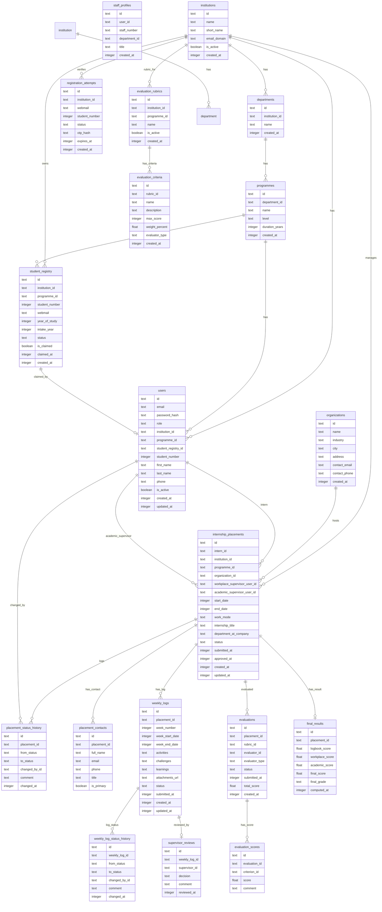

```mermaid
erDiagram
%% ===================
%%  AUTH & UNIVERSITY
%% ===================
institutions {
    text id
    text name
    text short_name
    text email_domain
    boolean is_active
    integer created_at
}
departments {
    text id
    text institution_id
    text name
    integer created_at
}
programmes {
    text id
    text department_id
    text name
    text level
    integer duration_years
    integer created_at
}
student_registry {
    text id
    text institution_id
    text programme_id
    integer student_number
    text webmail
    integer year_of_study
    integer intake_year
    text status
    boolean is_claimed
    integer claimed_at
    integer created_at
}
registration_attempts {
    text id
    text institution_id
    text webmail
    integer student_number
    text status
    text otp_hash
    integer expires_at
    integer created_at
}

%% ===================
%%  USERS & STAFF
%% ===================
users {
    text id
    text email
    text password_hash
    text role
    text institution_id
    text programme_id
    text student_registry_id
    integer student_number
    text first_name
    text last_name
    text phone
    boolean is_active
    integer created_at
    integer updated_at
}
staff_profiles {
    text id
    text user_id
    text staff_number
    text department_id
    text title
    integer created_at
}

%% ===================
%%  PLACEMENT & INTERNSHIP
%% ===================
organizations {
    text id
    text name
    text industry

    text city
    text address
    text contact_email
    text contact_phone
    integer created_at
}
internship_placements {
    text id
    text intern_id
    text institution_id
    text programme_id
    text organization_id
    text workplace_supervisor_user_id
    text academic_supervisor_user_id
    integer start_date
    integer end_date
    text work_mode
    text internship_title
    text department_at_company
    text status
    integer submitted_at
    integer approved_at
    integer created_at
    integer updated_at
}
placement_status_history {
    text id
    text placement_id
    text from_status
    text to_status
    text changed_by_id
    text comment
    integer changed_at
}
placement_contacts {
    text id
    text placement_id
    text full_name
    text email
    text phone
    text title
    boolean is_primary
}

%% ===================
%%  WEEKLY LOGS & REVIEWS
%% ===================
weekly_logs {
    text id
    text placement_id
    integer week_number
    integer week_start_date
    integer week_end_date
    text activities
    text challenges
    text learnings
    text attachments_url
    text status
    integer submitted_at
    integer created_at
    integer updated_at
}
weekly_log_status_history {
    text id
    text weekly_log_id
    text from_status
    text to_status
    text changed_by_id
    text comment
    integer changed_at
}
supervisor_reviews {
    text id
    text weekly_log_id
    text supervisor_id
    text decision
    text comment
    integer reviewed_at
}

%% ===================
%%  EVALUATIONS & SCORING
%% ===================
evaluation_rubrics {
    text id
    text institution_id
    text programme_id
    text name
    boolean is_active
    integer created_at
}
evaluation_criteria {
    text id
    text rubric_id
    text name
    text description
    integer max_score
    float weight_percent
    text evaluator_type
    integer created_at
}
evaluations {
    text id
    text placement_id
    text rubric_id
    text evaluator_id
    text evaluator_type
    text status
    integer submitted_at
    float total_score
    integer created_at
}
evaluation_scores {
    text id
    text evaluation_id
    text criterion_id
    float score
    text comment
}
final_results {
    text id
    text placement_id
    float logbook_score
    float workplace_score
    float academic_score
    float final_score
    text final_grade
    integer computed_at
}

%% ===================
%%  RELATIONSHIPS
%% ===================
institutions ||--o{ departments : has
departments ||--o{ programmes : has
institutions ||--o{ student_registry : owns
programmes ||--o{ student_registry : includes
institutions ||--o{ users : has
programmes ||--o{ users : has
student_registry ||--o| users : claimed_by
institutions ||--o{ registration_attempts : verifies
institutions ||--o{ internship_placements : manages
organizations ||--o{ internship_placements : hosts
users ||--o{ internship_placements : intern
users ||--o{ internship_placements : academic_supervisor
internship_placements ||--o{ placement_status_history : logs
users ||--o{ placement_status_history : changed_by
internship_placements ||--o{ placement_contacts : has_contact
internship_placements ||--o{ weekly_logs : has_log
weekly_logs ||--o{ weekly_log_status_history : log_status
weekly_logs ||--o| supervisor_reviews : reviewed_by
institutions ||--o{ evaluation_rubrics : rubric_for
evaluation_rubrics ||--o{ evaluation_criteria : has_criteria
internship_placements ||--o{ evaluations : evaluated
evaluations ||--o{ evaluation_scores : has_score
internship_placements ||--o| final_results : has_result
institution ||--o{ department : has

```
