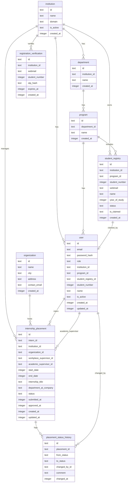

```mermaid
erDiagram
%% ===================
%%  AUTH
%% ===================

institution {
    text id
    text name
    text domain
    text is_active
    integer created_at
}

department {
    text id
    text institution_id
    text name
    integer created_at
}
program {
    text id
    text department_id
    text name
    integer created_at
}
student_registry {
    text id
    text institution_id
    text program_id
    integer student_number
    text webmail
    text name
    integer year_of_study
    text status
    text is_claimed
    integer created_at

}
user {
    text id
    text email
    text password_hash
    text role
    text institution_id
    text program_id
    text student_registry_id
    integer student_number
    text name
    text is_active
    integer created_at
    integer updated_at
}
%% This registration_verification table is under review by the team
registration_verification {
    text id
    text institution_id
    text webmail
    integer student_number
    text otp_hash
    integer expires_at
    integer created_at
}
internship_placement {
    text id
    text intern_id
    text institution_id
    text organization_id
    text workplace_supervisor_id
    text academic_supervisor_id
    integer start_date
    integer end_date
    text internship_title
    text department_at_company
    text status
    integer submitted_at
    integer approved_at
    integer created_at
    integer updated_at

}
organization {
    text id
    text name
    text city
    text address
    text contact_email
    integer created_at
}
placement_status_history {
    text id
    text placement_id
    text from_status
    text to_status
    text changed_by_id
    text comment
    integer changed_at
}

institution ||--o{ department : has
department ||--o{ program : has

institution ||--o{ student_registry : owns
program ||--o{ student_registry : includes

institution ||--o{ user : has
program ||--o{ user : has
student_registry ||--o| user : claimed_by

institution ||--o{ registration_verification : verifies

institution ||--o{ internship_placement : manages
organization ||--o{ internship_placement : hosts
user ||--o{ internship_placement : intern
user ||--o{ internship_placement : academic_supervisor

internship_placement ||--o{ placement_status_history : logs
user ||--o{ placement_status_history : changed_by
```
