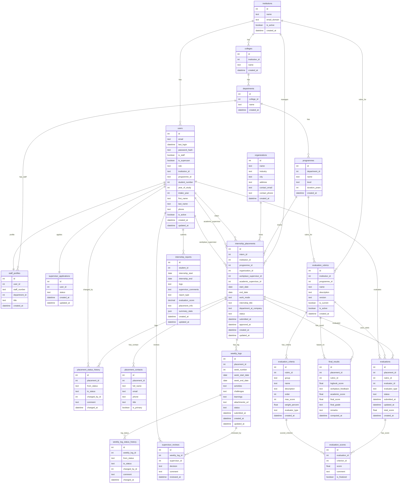

```mermaid
erDiagram
%% =========================
%%  ACADEMIC STRUCTURE
%% =========================
institutions {
    int id
    text name
    text email_domain
    boolean is_active
    datetime created_at
}
colleges {
    int id
    int institution_id
    text name
    datetime created_at
}
departments {
    int id
    int college_id
    text name
    datetime created_at
}
programmes {
    int id
    int department_id
    text name
    text level
    int duration_years
    datetime created_at
}

%% =========================
%%  USERS & STAFF
%% =========================
users {
    int id
    text email
    datetime last_login
    text password_hash
    boolean is_staff
    boolean is_superuser
    text role
    text institution_id
    text programme_id
    int student_number
    int year_of_study
    int intake_year
    text first_name
    text last_name
    text phone
    boolean is_active
    datetime created_at
    datetime updated_at
}
staff_profiles {
    int id
    int user_id
    text staff_number
    int department_id
    text title
    datetime created_at
}
supervisor_applications {
    int id
    int user_id
    text status
    datetime created_at
    datetime updated_at
}

%% =========================
%%  PLACEMENT & INTERNSHIP
%% =========================
organizations {
    int id
    text name
    text industry
    text city
    text address
    text contact_email
    text contact_phone
    datetime created_at
}
internship_placements {
    int id
    int intern_id
    int institution_id
    int programme_id
    int organization_id
    int workplace_supervisor_id
    int academic_supervisor_id
    date start_date
    date end_date
    text work_mode
    text internship_title
    text department_at_company
    text status
    datetime submitted_at
    datetime approved_at
    datetime created_at
    datetime updated_at
}
placement_status_history {
    int id
    int placement_id
    text from_status
    text to_status
    int changed_by_id
    text comment
    datetime changed_at
}
placement_contacts {
    int id
    int placement_id
    text full_name
    text email
    text phone
    text title
    boolean is_primary
}

%% =========================
%%  WEEKLY LOGS & REVIEWS
%% =========================
weekly_logs {
    int id
    int placement_id
    int week_number
    date week_start_date
    date week_end_date
    text activities
    text challenges
    text learnings
    text attachments_url
    text status
    datetime submitted_at
    datetime created_at
    datetime updated_at
}
weekly_log_status_history {
    int id
    int weekly_log_id
    text from_status
    text to_status
    int changed_by_id
    text comment
    datetime changed_at
}
supervisor_reviews {
    int id
    int weekly_log_id
    int supervisor_id
    text decision
    text comment
    datetime reviewed_at
}

%% =========================
%%  EVALUATIONS & SCORING
%% =========================
evaluation_rubrics {
    int id
    int institution_id
    int programme_id
    text name
    text description
    text version
    boolean is_current
    boolean is_active
    datetime created_at
}
evaluation_criteria {
    int id
    int rubric_id
    text group
    text name
    text description
    int order
    int max_score
    float weight_percent
    text evaluator_type
    datetime created_at
}
evaluations {
    int id
    int placement_id
    int rubric_id
    int evaluator_id
    text evaluator_type
    text status
    datetime submitted_at
    datetime updated_at
    float total_score
    datetime created_at
}
evaluation_scores {
    int id
    int evaluation_id
    int criterion_id
    float score
    text comment
    boolean is_finalized
}
final_results {
    int id
    int placement_id
    int rubric_id
    float logbook_score
    text workplace_feedback
    float academic_score
    float final_score
    text final_grade
    text remarks
    datetime computed_at
}

%% =========================
%%  REPORTING
%% =========================
internship_reports {
    int id
    int student_id
    date internship_start
    date internship_end
    text logs
    text supervisor_comments
    text report_type
    decimal evaluation_score
    text placement_info
    json summary_stats
    datetime created_at
    datetime updated_at
}

%% =========================
%%  RELATIONSHIPS
%% =========================
institutions ||--o{ colleges : has
colleges ||--o{ departments : has
departments ||--o{ programmes : has

institutions ||--o{ users : has
departments ||--o{ staff_profiles : has_staff
users ||--|| staff_profiles : profile
users ||--|| supervisor_applications : applies
institutions ||--o{ internship_placements : manages
programmes ||--o{ internship_placements : tracks
organizations ||--o{ internship_placements : hosts
users ||--o{ internship_placements : intern
users ||--o{ internship_placements : academic_supervisor
users ||--o{ internship_placements : workplace_supervisor
internship_placements ||--o{ placement_status_history : logs
users ||--o{ placement_status_history : changed_by
internship_placements ||--o{ placement_contacts : has_contact
internship_placements ||--o{ weekly_logs : has_log
weekly_logs ||--o{ weekly_log_status_history : log_status
weekly_logs ||--o{ supervisor_reviews : reviewed_by
users ||--o{ supervisor_reviews : reviews
institutions ||--o{ evaluation_rubrics : rubric_for
programmes ||--o{ evaluation_rubrics : rubric_for
evaluation_rubrics ||--o{ evaluation_criteria : has_criteria
internship_placements ||--o{ evaluations : evaluated
evaluation_rubrics ||--o{ evaluations : uses_rubric
users ||--o{ evaluations : evaluates
evaluations ||--o{ evaluation_scores : has_score
evaluation_criteria ||--o{ evaluation_scores : scored_criterion
internship_placements ||--o{ final_results : has_result
evaluation_rubrics ||--o{ final_results : based_on
users ||--o{ internship_reports : submits

```
